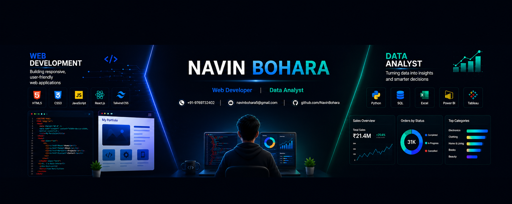

  

# Hi 👋, I'm Navin Bohara

### Data Analyst | Web Developer | AI Enthusiast

I am passionate about transforming data into actionable insights and building modern web applications that solve real-world problems. With experience in Data Analytics, Business Intelligence, Web Development, and AI-powered solutions, I enjoy combining technology and data to create impactful digital products.

---

## 🚀 About Me

* 🎓 Bachelor of Engineering in Information Technology
* 📊 Analyzed **30,000+ records** through internships and analytics projects
* 📈 Built **6+ interactive dashboards** using Power BI, Excel, SQL, and Python
* 💻 Developed **6+ web and analytics projects**
* 🤖 Built AI-powered applications using LLMs and APIs
* 🌱 Currently exploring AI applications, analytics, and full-stack development

---

## 📫 Connect With Me

* 📧 [navinbohara5@gmail.com](mailto:navinbohara5@gmail.com)
* 💼 LinkedIn: linkedin.com/in/navinbohara
* 🐙 GitHub: github.com/NavinBohara

---

### Building digital solutions with code, data, and AI 🚀
